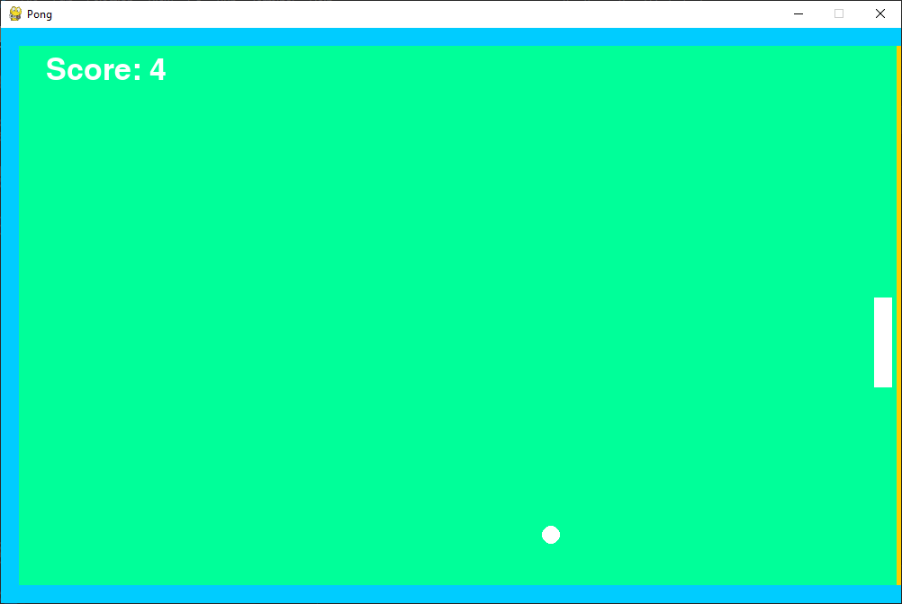
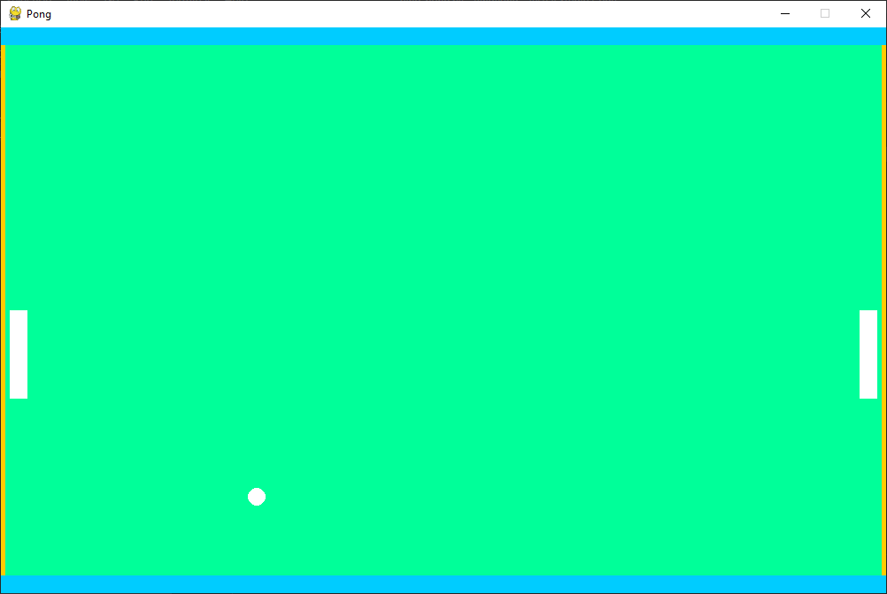

# Ping Pong
This game is made using only the PyGame framework.  
The whole game is written in one file containing something around 270 lines.  
It has 2 game modes, singleplayer and multiplayer





To run the game clone the repo and run  

```
python -m pip install -r requirements.txt 
python ping-pong.py
```
  
or if you have python 2 installed too  
```
python3 -m pip install -r requirements.txt 
python3 ping-pong.py
```
